# Forensic Codebase Audit Report: VV | WebApps Portal
**Date:** 2026-05-25  
**Auditor:** Lead Software Architect (Antigravity AI)  

---

## Executive Summary

The **VV | WebApps Portal** is a web-based client-side workspace that acts as a centralized host for multiple real-time MIDI processing plugins. It uses a "headless" plugin design to isolate complex modules from the core routing interface, allowing a single MIDI controller connection to drive any active tool. 

Our forensic audit shows that the codebase is highly clean, modern, and conforms to low-latency performance designs (specifically implementing decoupled synchronous audio triggers and throttled React UI updates). A few minor vestigial files and directories (such as boilerplate assets and an orphaned dummy component) have been identified.

---

## Changes Since Last Key Report

*No previous `*_REPO_REPORT.md` file was found in the repository.* This report serves as the initial baseline audit.

---

## Detailed Tree & Architecture Explanation

Below is the directory structure highlighting key source and configuration directories:

```text
midi-web-apps-portal/
├── public/                 # Static assets and Web Audio LUTs
│   ├── PCS_LUT.dat         # Look-Up Table for Pitch Class Matrix scale mapping
│   ├── favicon.svg
│   ├── icons.svg
│   └── fonts/
│       └── Bravura.woff2   # Standard Music Notation Font used by Chord Notator
├── src/
│   ├── main.jsx            # React 19 application entry point
│   ├── index.css           # Global CSS and Tailwind CSS v4 directives
│   ├── setupTests.js       # Vitest global setup (globals, jest-dom)
│   ├── assets/             # Branding assets
│   │   ├── hero.png
│   │   ├── react.svg       # Boilerplate logo (Unused)
│   │   └── vite.svg        # Boilerplate logo (Unused)
│   ├── config/             # Portal configurations
│   │   ├── appRegistry.js  # Main application registry metadata (sidebar settings)
│   │   └── appRegistry.test.js
│   ├── core/               # Master Host System
│   │   ├── App.css         # Portal-wide dashboard layout CSS
│   │   ├── App.jsx         # Global state, MIDI access manager, & layout router
│   │   ├── App.test.jsx    # Host-level React tests
│   │   ├── rompler/        # Shared Audio Drawer
│   │   │   ├── MasterRompler.jsx
│   │   │   ├── VUMeter.jsx
│   │   │   ├── rompler.css
│   │   │   ├── engine.js    # Master Audio Engine wrapper for smplr/Tone.js
│   │   │   ├── utils.js
│   │   │   └── usePersistentState.js
│   │   └── utils/          # Host utilities
│   │       ├── latencyProfiler.js       # Low-latency testing & performance measurement
│   │       └── latencyProfiler.test.js
│   ├── hooks/              # Empty directory
│   ├── plugins/            # Sandboxed Headless MIDI Plugins
│   │   ├── DummyPlugin.jsx              # Fallback / reference implementation
│   │   ├── DummyPlugin.test.jsx
│   │   ├── chord-notator/               # Real-time Sheet Music Notator (complex)
│   │   ├── dynamics/                    # Velocity compression/expansion curve editor
│   │   ├── monitor/                     # Real-time MIDI data analyzer and ledger
│   │   ├── note-range-filter/           # Keyboard limits/range filter
│   │   └── pitch-class-matrix/          # Matrix scale quantizer and visualizer
│   └── utils/              # Utility helpers
│       ├── ChameleonDummy.jsx           # Orphaned iframe context helper (Unused)
│       └── ChameleonDummy.test.jsx
```

### Architectural Pillars:
1. **Centralized MIDI Dispatcher**: The `App.jsx` host requests MIDI access exactly once. Instead of prop-drilling or React state-based event distribution, it publishes raw events into a ref-bound `EventTarget` MIDI event bus (`midiBusRef`). This completely bypasses React's rendering thread for raw MIDI propagation.
2. **Headless Module Isolation**: Each plugin under `src/plugins/` accepts standard props (`midiBus`, `onMidiOut`, `isBypassed`, etc.) and performs its own local calculations. When a plugin wants to trigger a sound, it fires `onMidiOut([status, note, velocity])`.
3. **Master Rompler Engine**: Inside `src/core/rompler/engine.js`, the Tone.js-backed sampler triggers instrument voices synchronously upon receiving `onMidiOut` events, ensuring sub-millisecond audio execution. UI state updates (such as active keyboard notes) are throttled to ~32ms via `lodash/throttle` to prevent layout lag.

---

## Component Interaction Analysis

The following diagram illustrates the flow of a single incoming hardware MIDI message through the system:

```mermaid
sequenceDiagram
    autonumber
    actor Keyboard as Hardware MIDI Keyboard
    participant Host as Host App (src/core/App.jsx)
    participant Bus as EventTarget (midiBusRef)
    participant Plugin as Active Plugin (e.g. ChordNotator)
    participant Rompler as Master Audio Rompler (src/core/rompler/engine.js)
    participant UI as Portal UI (React Render Loop)

    Keyboard->>Host: MIDI Note On [144, 60, 100]
    Host->>Host: Mark latencyProfiler input event
    Host->>Bus: Dispatch Event 'midi' (detail: [144, 60, 100])
    Bus->>Plugin: Notify Event Handlers (Synchronous)
    Plugin->>Plugin: Map / Process note (e.g. Symmetrical Speller)
    Plugin->>Host: onMidiOut([144, 60, 100]) (Synchronous)
    
    rect rgb(20, 30, 45)
        note right of Host: Split Path: Audio vs UI
        Host->>Rompler: playNoteOn(60, 100) (Instant Synchronous Audio)
        Host->>Host: push to activeNotesRef (useRef)
        Host->>UI: Throttled State Update (~32ms) -> update activeNotes State
    end
    
    UI->>UI: Re-render piano roll and ledger visualizers
```



---

## Vestigial File Report

A file or folder is flagged as vestigial if it is not imported, configured, or executed in any part of the main application lifecycle, testing suites, or documentation.

### 🔴 High Confidence (Dead Source / Orphaned Tests / Unused Boilerplate)
1. **[ChameleonDummy.jsx](file:///Users/vv2024/Documents/Repos%20-%20vv2024/MIDI/WebApps/midi-web-apps-portal/src/utils/ChameleonDummy.jsx)**:
   - *Rationale:* An utility component checking whether it is embedded in an iframe. It is never imported by the core host or any plugin.
2. **[ChameleonDummy.test.jsx](file:///Users/vv2024/Documents/Repos%20-%20vv2024/MIDI/WebApps/midi-web-apps-portal/src/utils/ChameleonDummy.test.jsx)**:
   - *Rationale:* The associated test file. Can be safely removed alongside `ChameleonDummy.jsx`.
3. **[src/hooks](file:///Users/vv2024/Documents/Repos%20-%20vv2024/MIDI/WebApps/midi-web-apps-portal/src/hooks)**:
   - *Rationale:* An empty directory in the source tree with no hook files inside it.
4. **[RomplerFooter.tsx](file:///Users/vv2024/Documents/Repos%20-%20vv2024/MIDI/WebApps/midi-web-apps-portal/src/plugins/chord-notator/components/RomplerFooter.tsx)**:
   - *Rationale:* Disconnected component inside the `chord-notator` plugin; it is never imported or referenced.
5. **[VUMeter.tsx](file:///Users/vv2024/Documents/Repos%20-%20vv2024/MIDI/WebApps/midi-web-apps-portal/src/plugins/chord-notator/components/VUMeter.tsx)**:
   - *Rationale:* Only imported by the unused `RomplerFooter.tsx`.
6. **[Knob.tsx](file:///Users/vv2024/Documents/Repos%20-%20vv2024/MIDI/WebApps/midi-web-apps-portal/src/plugins/chord-notator/components/Knob.tsx)**:
   - *Rationale:* Only imported by the unused `RomplerFooter.tsx`.
7. **[NavController.tsx](file:///Users/vv2024/Documents/Repos%20-%20vv2024/MIDI/WebApps/midi-web-apps-portal/src/plugins/chord-notator/components/NavController.tsx)**:
   - *Rationale:* Disconnected/unused component.
8. **[navTypes.ts](file:///Users/vv2024/Documents/Repos%20-%20vv2024/MIDI/WebApps/midi-web-apps-portal/src/plugins/chord-notator/components/navTypes.ts)**:
   - *Rationale:* Only imported by the unused `NavController.tsx`.
9. **[ErrorBoundary.tsx](file:///Users/vv2024/Documents/Repos%20-%20vv2024/MIDI/WebApps/midi-web-apps-portal/src/plugins/chord-notator/components/ErrorBoundary.tsx)**:
   - *Rationale:* Disconnected React error boundary utility.
10. **[MidiPortSelector.tsx](file:///Users/vv2024/Documents/Repos%20-%20vv2024/MIDI/WebApps/midi-web-apps-portal/src/plugins/chord-notator/midi/MidiPortSelector.tsx)**:
    - *Rationale:* Legacy port selector UI that has been replaced by the host's global top-bar MIDI input source dropdown. Never imported or referenced.

### 🟡 Medium Confidence (Review Needed / Disconnected Assets)
1. **[react.svg](file:///Users/vv2024/Documents/Repos%20-%20vv2024/MIDI/WebApps/midi-web-apps-portal/src/assets/react.svg)**:
   - *Rationale:* Boilerplate React logo. Unused.
2. **[vite.svg](file:///Users/vv2024/Documents/Repos%20-%20vv2024/MIDI/WebApps/midi-web-apps-portal/src/assets/vite.svg)**:
   - *Rationale:* Boilerplate Vite logo. Unused.

### 🟢 Low Confidence (Likely Useful but Isolated)
1. **[DummyPlugin.jsx](file:///Users/vv2024/Documents/Repos%20-%20vv2024/MIDI/WebApps/midi-web-apps-portal/src/plugins/DummyPlugin.jsx)**:
   - *Rationale:* While not registered in `appRegistry.js`, it is imported as the default/fallback component in `src/core/App.jsx` for missing app IDs. Highly useful as a fallback and developer test harness reference.
2. **[DummyPlugin.test.jsx](file:///Users/vv2024/Documents/Repos%20-%20vv2024/MIDI/WebApps/midi-web-apps-portal/src/plugins/DummyPlugin.test.jsx)**:
   - *Rationale:* Associated unit tests that verify fallback UI functionality and event-bus responsiveness. Keep active.
