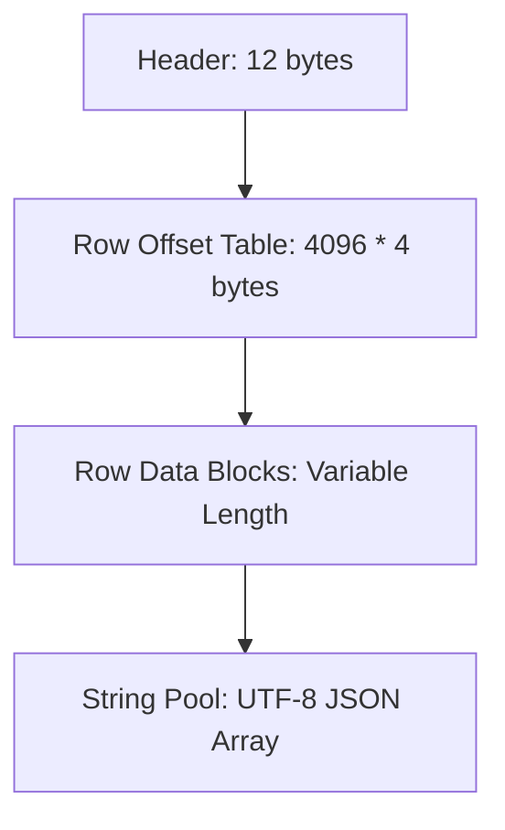

# How To Generate the PCS_LUT.dat Binary Database

The Chord Notator and related MIDI visualizers load a 2MB binary database file (`PCS_LUT.dat`) to perform O(1) bitmask-based chord and scale lookups at zero-latency in the browser. 

The binary file is compiled from a raw `PCS_LUT.json` database.

---

## 1. Script & File Locations

* **Source JSON Database**: 
  [PCS_LUT.json](file:///Users/vv2024/Documents/Repos%20-%20vv2024/MIDI/PCS_LUT%20Editor/src/data/PCS_LUT.json)
* **Generator/Packer Script**: 
  [pack_lut.js](file:///Users/vv2024/Documents/Repos%20-%20vv2024/MIDI/react-midi-components/scripts/pack_lut.js)
* **Target Output**: 
  `./public/PCS_LUT.dat` (generated relative to the script run location, and then copied to target plugins/apps as needed).

---

## 2. Compilation Instructions

To regenerate the binary database:

1. **Open a terminal** and navigate to the `react-midi-components` workspace directory:
   ```bash
   cd "/Users/vv2024/Documents/Repos - vv2024/MIDI/react-midi-components"
   ```
2. **Execute the packer script** using Node.js:
   ```bash
   node scripts/pack_lut.js
   ```
3. **Verify the output**:
   You should see a console confirmation similar to:
   ```text
   Reading from /Users/vv2024/Documents/Repos - vv2024/MIDI/PCS_LUT Editor/src/data/PCS_LUT.json...
   Packed 4096 entries into 2238316 bytes.
   Saved to ./public/PCS_LUT.dat
   ```
4. **Deploy the updated LUT**:
   Copy the newly generated `PCS_LUT.dat` from the `public/` directory of `react-midi-components` into the static asset directory (usually `/public/` or plugin assets folder) of the target web applications/plugins (e.g., `midi-web-apps-portal`, `midi-chord-notator-web`, or `midi-scale-stepper`).

---

## 3. Binary File Format Specification (`PLUT`)

The file starts with a small file header, followed by a lookup table of offsets, then the serialized row data, and finally the string pool dictionary.

### File Layout



### 3.1. Header (12 Bytes)
* **Byte 0-3**: Magic Identifier string `"PLUT"` (4 bytes ASCII).
* **Byte 4-7**: `stringPoolOffset` (4 bytes, little-endian `uint32`) — points to the starting byte of the String Pool.
* **Byte 8-11**: `rowsCount` (4 bytes, little-endian `uint32`) — number of rows in the table (always `4096`).

### 3.2. Row Offset Table ($4096 \times 4$ bytes = 16,384 bytes)
* Starting at byte offset 12, there are 4096 entries of 4-byte little-endian `uint32` offsets.
* Each index represents a 12-bit pitch class set decimal representation (from `0` to `4095`).
* If the value is `0`, no data exists for that entry.
* If non-zero, it specifies the absolute byte offset in the file where the entry's **Row Data** block begins.

### 3.3. Row Data Block (Variable Length)
Each row block starts with a **Fixed Header** followed by **Variable Length Arrays**.

#### Fixed Header (64 Bytes)
* **0-3**: `decimal` (`uint32` - 4 bytes)
* **4**: `root_pc` (`uint8` - 1 byte)
* **5**: `cardinality` (`uint8` - 1 byte)
* **6**: `rotation` (`uint8` - 1 byte)
* **7**: `mode` (`uint8` - 1 byte)
* **8**: `hemitonia` (`uint8` - 1 byte)
* **9**: `cohemitonia` (`uint8` - 1 byte)
* **10**: `brightness` (`int8` - 1 byte)
* **11**: Padding/Reserved (`uint8` - 1 byte)
* **12-15**: `dissonance` (`float32` - 4 bytes)
* **16-33**: String Pool indices (9 fields $\times$ `uint16` = 18 bytes):
  - `chord_type`
  - `data_table_chord_type`
  - `base_triad`
  - `base_7th`
  - `scale_type`
  - `root_scale`
  - `mode_function`
  - `12-bit`
  - `diatonic_chromatic_exotic`
* **34-43**: Black Key Root Spellings indices (5 keys $\times$ `uint16` = 10 bytes) for keys: `"1"`, `"3"`, `"6"`, `"8"`, `"10"`.
* **44-51**: Variable Array lengths (8 counts $\times$ `uint8` = 8 bytes):
  - `chord_intervals` length
  - `chord_intervals_rotated` length
  - `scale_intervals` length
  - `pitch_class_set` length
  - `pc_intervals` length
  - `ic_vector` length
  - `manual_overrides` length
  - Padding/Reserved byte
* **52-63**: Padding/Reserved (`12 bytes`) to align the fixed header to 64 bytes.

#### Variable Data (Appended immediately after Fixed Header)
Contains the items of the arrays sequentially:
1. `chord_intervals` indices (`uint16[]`)
2. `chord_intervals_rotated` indices (`uint16[]`)
3. `scale_intervals` indices (`uint16[]`)
4. `pitch_class_set` values (`uint8[]`)
5. `pc_intervals` values (`uint8[]`)
6. `ic_vector` values (`uint8[]`)
7. `manual_overrides` indices (`uint16[]`)

---

## 4. How the Frontend Decodes the Binary LUT

The frontend loads the binary file via an HTTP fetch request and parses it back into JavaScript objects using a `DataView` for high performance. 

You can view the full client implementation details in:
* **[binaryLut.ts](file:///Users/vv2024/Documents/Repos%20-%20vv2024/MIDI/WebApps/midi-web-apps-portal/src/plugins/chord-notator/utils/binaryLut.ts)**
